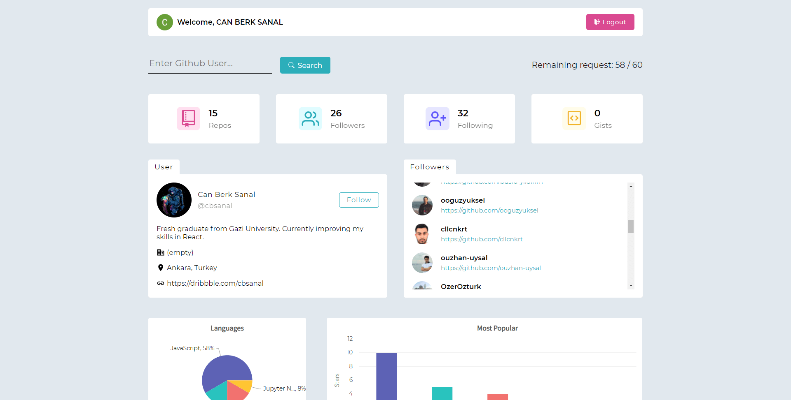
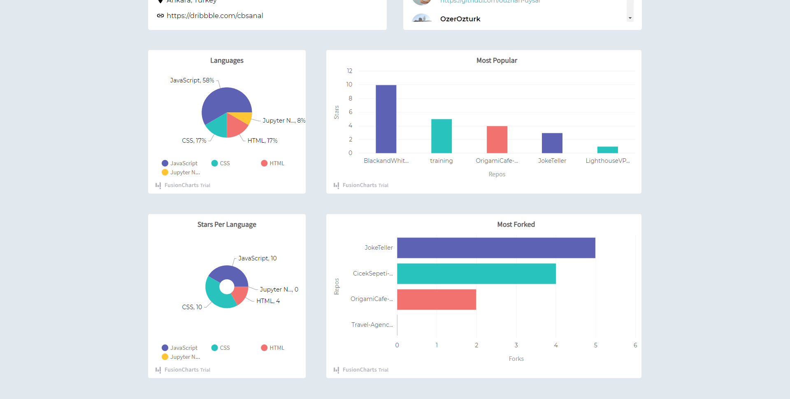

## About Project

You can run `yarn install` or `npm install` for downloading packages.

After that you need to run `yarn start` or `npm start` to start the localhost.

### Important!

You need to have Auth0 clientId and domain in order to use the app.

You can get them from <a href="https://auth0.com/docs">here</a> for free.

### Used Technologies
<ul>
  <li>React</li>
  <li>SASS</li>
  <li>Fusion Charts</li>
  <li>Auth0</li>
</ul>

### Live Version

You can check out live version by clicking <a href="https://github-user-analysis-website.netlify.app/login">here</a>.

### Images of website

